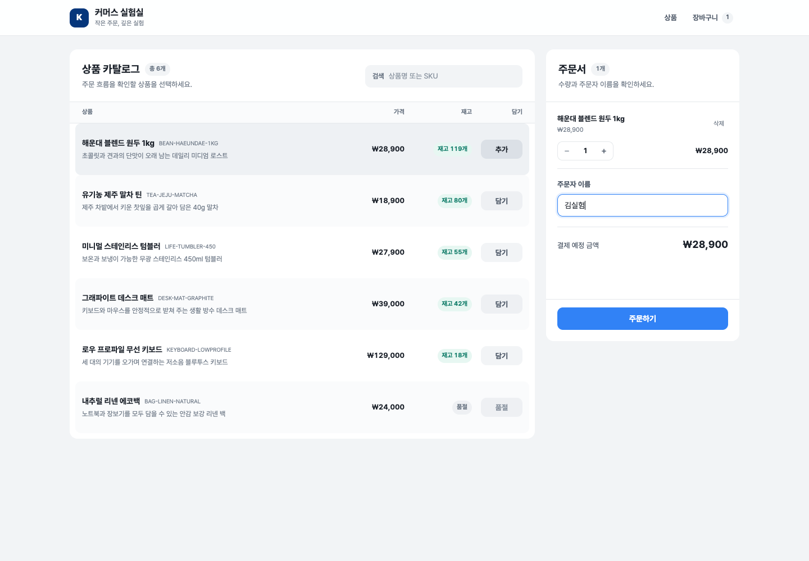

# my-awesome-project

[](https://github.com/kergosdyr/my-awesome-project/actions/workflows/ci.yml)

작은 커머스를 기반으로 동시성, 캐시, Redis, Kafka, 대기열, 관측성을 **직접 재현하고 수치로 비교하는** 공개 엔지니어링 랩입니다.

완성된 쇼핑몰을 만드는 것보다 같은 상품 조회·주문 시나리오에서 기술 선택이 정합성, 성능, 장애 복구, 운영 복잡도에 어떤 차이를 만드는지 코드와 측정 결과로 설명하는 것을 목표로 합니다.

## 현재 기준선

- Next.js App Router + TypeScript + shadcn/ui 기반 상품 탐색·장바구니·주문 UI
- Spring Boot 4.1.0 + Java 21 + Gradle Wrapper 8.14.4 기반 상품 조회 Query와 주문 생성 Command
- MySQL, JPA, Flyway를 사용한 영속성 기준선
- Docker Compose 한 번으로 실행되는 FE–BE–DB 구성
- k6 공통 시나리오와 동일 조건 전후 비교 규약

기본 흐름은 `상품 조회 → 장바구니 → 주문 → 재고 차감`입니다.



## 빠른 시작

Docker와 Docker Compose가 필요합니다.

```bash
cp .env.example .env
make up
```

브라우저에서 <http://localhost:3000>을 엽니다. 백엔드 API는 <http://localhost:8080>에서 실행됩니다.

첫 상품 목록은 App Router Server Component가 서버 전용 `BACKEND_ORIGIN`에서 읽어 초기 화면에 전달합니다. 이후 브라우저의 상품 재시도와 주문 요청은 같은 origin의 `GET /api/products`와 `POST /api/orders`를 사용하고, route handler가 같은 백엔드 주소로 전달합니다. Docker Compose에서는 `http://backend:8080`, 로컬 프론트엔드 개발에서는 기본값 `http://localhost:8080`을 사용합니다.

```bash
make logs       # 전체 로그
make test       # FE/BE 검증
make down       # 컨테이너 중지, DB 볼륨 보존
```

## 학습 방식

`main`은 언제나 실행 가능한 기준선입니다. 실험은 미리 만든 빈 브랜치가 아니라, 질문과 성공 기준이 정해진 시점에 `lab/<topic>` 브랜치로 시작합니다.

1. GitHub Issue에 질문, 가설, 부하 조건, 완료 기준을 적습니다.
2. 검증된 `main` 또는 기준 태그에서 `lab/<topic>`을 만듭니다.
3. 변경 전 기준선을 먼저 측정합니다.
4. 구현 후 같은 데이터와 요청 프로파일로 다시 측정합니다.
5. Draft PR에 설계, 실패 사례, 원시 결과, 결론을 축적합니다.
6. 공통 기반만 `main`에 반영하고 실험 구현은 태그로 동결할 수 있습니다.

빈 브랜치를 미리 만들지 않는 이유는 시간이 지나면 기준선과 자동으로 벌어지고, 의존성·보안 업데이트와 충돌 관리만 중복되기 때문입니다. 예정된 공부는 아래 로드맵과 Issue가 더 정확하게 표현합니다.

## Labs & Roadmap

| 단계 | 브랜치 | 질문 | 대표 검증 지표 |
| --- | --- | --- | --- |
| 0 | `main` | 비교 가능한 기준선인가? | 한 명령 실행, 고정 seed, E2E 주문, 고정 k6 프로파일 |
| 1 | `lab/cache-stampede` | hot key 만료 순간의 DB 폭주를 억제할 수 있는가? | origin load 수, hit ratio, p95/p99, 오류율 |
| 2 | `lab/kafka-outbox` | 주문 후 처리를 분리하면서 이벤트 유실·중복을 통제할 수 있는가? | API p95, publish 지연, consumer lag, 유실·중복 부수효과 |
| 3 | `lab/waiting-room` | 폭주 시 활성 구매자를 제한하면서 순서를 지킬 수 있는가? | 동시 진입 상한, 대기 시간, 공정성, 우회·만료 처리 |
| 4 | `lab/stock-concurrency` | 동시 주문에서 초과 판매를 막을 수 있는가? | 음수 재고 0, 성공 수와 초기 재고 일치, lock wait |
| 5 | `lab/redis-cart` | 장바구니 상태를 Redis로 옮겨도 유실·격리가 없는가? | 동시 갱신 유실, 사용자 격리, TTL, 장애 정책 |
| 6 | `lab/rate-limiting` | 여러 인스턴스에 동일한 제한을 적용할 수 있는가? | 허용/거절 정확도, 원자성, Redis 장애 동작 |
| 7 | `lab/flash-sale-integration` | 실험들을 하나의 플래시 세일 흐름으로 조합할 수 있는가? | 정합성, p95/p99, 오류율, 복구 시간 |

절대 수치보다 **같은 조건에서 무엇이 얼마나 달라졌고 어떤 비용이 생겼는지**를 우선합니다. 실행 환경이 다른 결과는 직접적인 우열 비교에 사용하지 않습니다.

### 측정 완료

- [통합 부하 테스트 보고서](docs/reports/load-test-report.md) · [portable HTML](docs/reports/load-test-report.html) · [원시 결과](docs/reports/raw/)
- [Cache stampede Draft PR #4](https://github.com/kergosdyr/my-awesome-project/pull/4): origin load `985 → 119` (-87.9%)
- [Kafka transactional outbox Draft PR #5](https://github.com/kergosdyr/my-awesome-project/pull/5): broker 중단 중 주문 의도 보존과 멱등 복구
- [Redis waiting-room Draft PR #6](https://github.com/kergosdyr/my-awesome-project/pull/6): 수락률 `72.736% → 100%`, max active 4, FIFO 위반 0

세 lab은 `main`에 한꺼번에 합치지 않았다. 각 Draft PR이 실행 가능한 독립 실험과 측정 근거를 보존하고, [`baseline/v1`](https://github.com/kergosdyr/my-awesome-project/tree/baseline/v1)은 비교 기준선을 고정한다.

Draft PR #4–#6의 lab 브랜치는 아직 Gradle 기준선으로 옮기지 않았다. 이 기준선이 수용된 뒤 각 브랜치의 Maven 의존성을 Gradle로 번역하고 Redis/Kafka Compose 차이를 의도적으로 조정해야 하며, 기존 브랜치 이력과 측정 근거는 재작성하지 않는다.

## 저장소 구조

```text
frontend/       Next.js App Router UI와 프론트엔드 데이터 경계
backend/        Gradle 기반 Spring Boot API, 도메인, MySQL 인프라
load-tests/     공통 k6 시나리오와 원시 측정 결과 규약
docs/           기준선 아키텍처, 실험 템플릿, 검증 보고서
compose.yaml    로컬 전체 스택
```

- [기준선 아키텍처](docs/architecture.md)
- [실험 운영 규칙](docs/labs/README.md)
- [실험 문서 템플릿](docs/labs/_template.md)

## 주의사항

이 저장소의 측정값은 로컬 학습 환경에서 얻은 결과이며 운영 환경의 용량 보장을 의미하지 않습니다. 실험 보고서는 검증한 범위, 실패 조건, 재현하지 못한 항목을 함께 기록합니다.
