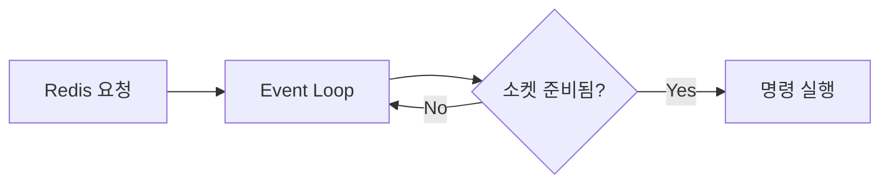

# 글 작성하기

이 블로그는 별도 CMS 없이 Markdown 파일과 커버 이미지 한 장으로 글을 발행합니다.

## 1. 커버 이미지 넣기

이미지를 `public/images/posts/`에 복사합니다. 권장 비율은 4:3이며 PNG, JPG, WebP를 사용할 수 있습니다.

```text
public/images/posts/my-new-post.webp
```

## 2. Markdown 글 만들기

`src/content/posts/`에 URL로 사용할 이름의 Markdown 파일을 추가합니다.

```md
---
title: "새 글 제목"
category: "Architecture"
date: "2026-08-14"
readingTime: "5 min"
summary: "목록 카드와 상세 히어로에 표시되는 짧은 소개입니다."
coverImage: "/images/posts/my-new-post.webp"
coverAlt: "이미지에 보이는 내용을 설명하는 대체 텍스트"
series: "Redis에서 시작한 서버 I/O 탐구"
seriesOrder: 1
---

첫 문단부터 본문을 작성합니다.

## 소제목도 사용할 수 있습니다

- 목록
- 링크
- 인라인 코드도 Markdown 문법으로 작성할 수 있습니다.
```

파일을 추가하면 목록, 상세 페이지, 메타데이터와 사이트맵에 자동 반영됩니다.

## 3. 시리즈로 묶기

연재 글에는 같은 `series` 이름과 1부터 시작하는 `seriesOrder`를 넣습니다. 시리즈가 아닌 단독 글에서는 두 항목을 모두 생략합니다.

```yaml
series: "Redis에서 시작한 서버 I/O 탐구"
seriesOrder: 2
```

시리즈 글은 상세 페이지의 전체 목차와 이전·다음 편에 순서대로 표시됩니다. 순서가 겹치지 않도록 같은 시리즈 안에서 `seriesOrder`를 고유하게 관리합니다.

## 4. Mermaid 다이어그램 넣기

본문에 `mermaid` 코드 블록을 작성하면 브라우저에서 다이어그램으로 렌더링됩니다.

````md

````

다이어그램 문법에 오류가 있거나 렌더링할 수 없는 환경에서는 독자가 내용을 잃지 않도록 Mermaid 원본 코드가 대신 표시됩니다. 복잡한 설명은 노드 수를 줄이고, 긴 문장은 본문에서 풀어 쓰는 편이 모바일에서도 읽기 좋습니다.

## 5. 본문 이미지 넣기

본문용 이미지는 `public/images/posts/` 아래에 저장하고 일반 Markdown 이미지 문법으로 삽입합니다. 이미지는 글 너비에 맞춰 줄어들며 모바일에서도 화면 밖으로 넘치지 않습니다.

```md

```

대체 텍스트에는 장식적인 인상보다 이미지가 설명하는 구조와 관계를 적습니다. 동작 순서나 비교처럼 정확성이 중요한 그림은 Mermaid를, 분위기나 개념을 전달하는 그림은 이미지 파일을 사용하는 편이 좋습니다.

## 출처 표기

- 글의 출처 링크는 본문 중간에 넣지 않고 맨 마지막 `## 출처` 아래에 모아 작성한다.
- 같은 출처는 한 번만 표기한다. 본문의 말투와 전개를 유지한다.


## 실험 차트 넣기

`chart` 코드 블록에 JSON을 작성하면 shadcn ChartContainer와 Recharts로 막대 차트를 그린다. Markdown 본문은 그대로 유지되며, 막대 끝의 수치와 툴팁을 함께 제공한다. 값은 0 이상의 유한한 숫자, 데이터는 1~20행이다. 잘못된 블록은 원문 코드로 표시된다.

````md
```chart
{"title":"최종 실패 건수","description":"같은 조건에서 각 2회 측정한 합계","unit":"건","data":[{"label":"재시도 없음","value":154},{"label":"최대 3회","value":16}]}
```
````

초안은 `drafts/`에 보관한다. `BLOG_PREVIEW_DRAFTS=1 npm run dev`로 실행하면 파일 이름에 해당하는 경로에서 초안을 확인할 수 있다. 예를 들어 `drafts/05-optimistic-lock-retry.md`는 `/05-optimistic-lock-retry`다. 이 기능은 개발 모드에서만 켜지고 목록·사이트맵에는 초안을 추가하지 않는다.
