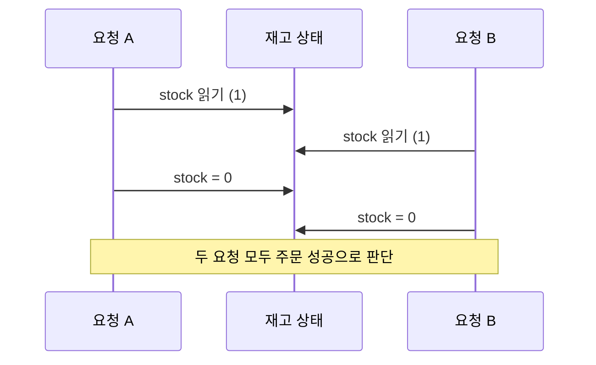

재고가 1개 남았다. 서로 다른 두 고객이 거의 동시에 주문 버튼을 눌렀다. 두 요청이 실행하는 코드는 단순하다.

```java
if (stock > 0) {
    stock--;
    createOrder();
}
```

요청 하나만 놓고 보면 틀린 곳을 찾기 어렵다. 재고를 확인하고, 남아 있으면 하나 줄인 뒤 주문을 만든다. 그런데 두 실행을 겹쳐 놓으면 결과가 달라진다.

```text
stock = 1

요청 A: stock 읽기 → 1
요청 B: stock 읽기 → 1
요청 A: 주문 가능 판단
요청 B: 주문 가능 판단
요청 A: stock = 0, 주문 생성
요청 B: stock = 0, 주문 생성
```

재고는 0인데 주문은 2개다. 각 요청의 코드는 혼자서는 옳았지만, 함께 실행되자 시스템이 틀렸다.

이 장면에 동시성 문제의 거의 모든 것이 들어 있다.

## 동시 실행 자체는 문제가 아니다

서버에는 늘 여러 요청이 들어온다. 서로 다른 상품을 조회하는 두 요청, 각자 다른 사용자의 프로필을 수정하는 두 요청은 동시에 실행되어도 아무 문제가 없을 수 있다. 같은 값을 읽기만 하는 두 실행도 보통 충돌하지 않는다.

문제가 되려면 몇 가지 조건이 겹친다.

1. 둘 이상의 실행 주체가 있다.
2. 같은 **논리적 상태**에 접근한다.
3. 그중 적어도 하나가 상태를 변경한다.
4. 연산들이 서로 충돌할 수 있다.
5. 실행이 섞이는 방식에 따라 올바름이 달라진다.

여기서 공유 대상은 반드시 같은 Java 객체일 필요가 없다. 한 JVM에서는 메모리의 필드일 수 있고, 여러 서버에서는 DB의 같은 행일 수 있다. 더 넓게는 `남은 재고`, `주문의 결제 상태`, `계좌 잔액의 합`처럼 여러 저장소에 걸친 비즈니스 상태일 수도 있다.

따라서 동시성 문제를 “여러 스레드가 같은 변수를 건드리는 문제”로만 정의하면 너무 좁다. 더 오래 쓸 수 있는 정의는 다음과 같다.

> 여러 실행 주체가 같은 논리적 상태에 대해 충돌 가능한 연산을 수행하고, 통제할 수 없는 상대적 순서 때문에 시스템의 불변조건이 깨지는 문제.

## 코드에는 한 줄이지만 실행에는 틈이 있다

`stock--`는 소스 코드에서 한 줄이다. 그렇다고 반드시 하나의 원자적 연산인 것은 아니다. 개념적으로는 다음 단계로 나뉜다.

```text
현재 값을 읽는다
→ 1을 뺀 값을 계산한다
→ 계산한 값을 저장한다
```

`if (stock > 0)`까지 포함하면 논리적 작업은 더 길어진다.

```text
조회 → 조건 확인 → 계산 → 저장 → 주문 생성
```

우리는 이 과정을 “재고 하나를 판매한다”라는 한 행동으로 생각한다. 컴퓨터가 실제로 수행하는 동안에는 여러 관찰 가능한 단계가 있고, 그 사이에 다른 실행이 들어올 수 있다.



이렇게 여러 실행의 단계가 섞이는 것을 **인터리빙(interleaving)**이라고 부른다. 가능한 인터리빙은 많고, 운영체제의 스케줄링, CPU, 네트워크 지연, DB 대기 시간에 따라 달라진다. 대부분의 실행에서는 우연히 문제가 보이지 않다가 특정 순서에서만 실패하는 이유다.

동시성이 어려운 이유를 한 문장으로 줄이면 **시간이 프로그램의 숨은 입력이 되기 때문**이라고 말할 수 있다. 같은 코드와 같은 명시적 입력을 사용해도 실행의 상대적 순서가 달라지면 결과가 달라진다.

## 먼저 지켜야 할 사실을 문장으로 쓴다

위 예제에서 진짜 문제는 `stock`이라는 변수를 동시에 수정했다는 사실만이 아니다. 시스템이 지켜야 할 규칙이 깨졌다는 데 있다.

```text
성공한 주문 수는 판매 가능한 재고를 초과할 수 없다.
```

이처럼 실행 전후에 반드시 참이어야 하는 규칙을 **불변조건(invariant)**이라고 한다. 동시성 제어의 목적은 락을 거는 것이 아니라, 가능한 실행 순서 속에서도 이 불변조건을 유지하는 것이다.

불변조건은 변수 하나보다 넓을 수 있다.

```text
accountA = 50
accountB = 50

불변조건: accountA + accountB = 100
```

A 계좌에서 10을 빼고 B 계좌에 10을 더하는 이체 도중 다른 실행이 중간 상태를 읽으면 합계 90을 관찰할 수 있다. 각각의 값 읽기와 쓰기가 원자적이어도, **두 상태를 묶은 더 큰 규칙**은 깨질 수 있다.

그래서 “원자 변수로 바꾸면 해결되는가?”라는 질문보다 먼저 해야 할 질문은 이것이다.

> 어떤 상태 변화 전체가 하나의 논리적 작업처럼 보여야 하는가?

## 임계영역은 락이 만들어내는 코드 블록이 아니다

`synchronized` 블록을 보면 우리는 그 안을 임계영역이라고 부른다. 하지만 문제를 찾는 순서는 반대다.

```text
이 연산들이 서로 섞이면 불변조건이 깨진다
→ 그러므로 함께 보호해야 할 논리적 범위가 있다
→ 그 범위를 보호할 적절한 수단을 선택한다
```

즉 임계영역은 특정 문법이 아니라 **충돌하는 실행과 섞이지 않도록 다뤄야 하는 논리적 연산 범위**다. 재고 예제에서는 `재고 확인 → 재고 차감 → 주문 성공 결정`이 그 범위다.

범위를 너무 작게 잡으면 락이 있어도 틀릴 수 있다.

```java
int current;

synchronized (lock) {
    current = stock;
}

if (current > 0) {
    synchronized (lock) {
        stock = current - 1;
    }
}
```

읽기와 쓰기를 각각 보호했지만 둘 사이의 판단은 보호하지 않았다. 두 실행이 같은 `current`를 얻을 수 있으므로 check-then-act 경쟁은 그대로다. 보호해야 하는 것은 개별 접근이 아니라 불변조건을 바꾸는 **전체 상태 전이**다.

## Race condition과 data race는 같은 말일까

두 표현은 자주 섞여 쓰이지만 범위가 다르다.

- **Race condition**은 실행 순서나 타이밍에 따라 프로그램의 올바름이 달라지는 더 넓은 개념이다.
- **Data race**는 공유 메모리에서 동기화되지 않은 충돌 접근이 발생하는 더 구체적인 상황을 가리킨다.

모든 data race는 위험한 신호지만, data race가 없다고 모든 고수준 race condition이 사라지는 것은 아니다. 스레드 안전한 메서드 두 개를 `확인 후 실행`으로 조합하면 각 호출은 안전해도 조합된 비즈니스 연산은 경쟁할 수 있다.

```java
if (!concurrentMap.containsKey(key)) {
    concurrentMap.put(key, value);
}
```

`containsKey`와 `put` 각각은 스레드 안전하지만 둘 사이에 다른 실행이 들어올 수 있다. 이 경우에는 `putIfAbsent`처럼 의도를 하나의 원자적 상태 전이로 표현해야 한다.

## 해결책은 모두 허용 가능한 상태 전이를 정한다

동시성 기술은 서로 달라 보여도 같은 질문에 답한다.

```text
synchronized / Lock
→ 한 번에 하나의 실행만 임계영역에 들어오게 한다

CAS / 조건부 UPDATE
→ 내가 관찰한 상태가 아직 그대로일 때만 변경한다

DB constraint
→ 잘못된 최종 상태의 저장 자체를 거부한다

Queue / partition
→ 같은 자원의 변경을 한 실행 흐름으로 모은다
```

목표는 모든 실행을 한 줄로 세우는 것이 아니다. 서로 영향을 주지 않는 작업은 최대한 동시에 진행시키되, 충돌하는 상태 변화만 올바른 결과로 수렴시키는 것이다.

재고가 1개일 때 A가 성공하고 B가 실패해도 괜찮고, B가 성공하고 A가 실패해도 괜찮다. 누가 반드시 먼저여야 하는 것이 아니라 **둘 다 성공하는 금지된 결과**만 나오지 않으면 된다.

이 관점은 동시성 제어를 “정확한 실행 순서를 미리 정하는 일”이 아니라 “어떤 인터리빙에서도 허용된 상태만 남게 만드는 일”로 바꾼다.

## 코드를 볼 때 던질 다섯 가지 질문

동시성 버그를 찾을 때 곧바로 락 종류부터 고르지 않는다. 다음 순서로 보면 문제의 경계가 선명해진다.

1. 공유되는 논리적 상태는 무엇인가?
2. 반드시 지켜야 할 불변조건은 무엇인가?
3. 어떤 연산들이 서로 충돌하는가?
4. 내가 하나라고 생각한 작업은 실제로 어디에서 나뉘는가?
5. 그 틈에 다른 실행이 들어오면 어떤 금지된 상태가 가능한가?

여기까지 답한 뒤에야 해결책의 조건이 생긴다. 한 JVM 안의 필드라면 Java Memory Model과 락을 봐야 하고, DB 행이라면 트랜잭션과 조건부 갱신을 봐야 한다. 여러 서버와 외부 시스템에 걸친 상태라면 장애와 네트워크 지연까지 모델에 넣어야 한다.

다음 편에서는 먼저 가장 가까운 경계인 JVM 안으로 들어간다. `volatile`, `synchronized`, `ReentrantLock`, 세마포어와 CAS가 각각 무엇을 보장하고 무엇을 보장하지 않는지, 같은 재고 예제를 통해 확인한다.

## 더 읽어보기

- [Java Language Specification: Threads and Locks](https://docs.oracle.com/javase/specs/jls/se21/html/jls-17.html)
- [Java ConcurrentHashMap API](https://docs.oracle.com/en/java/javase/21/docs/api/java.base/java/util/concurrent/ConcurrentHashMap.html)
