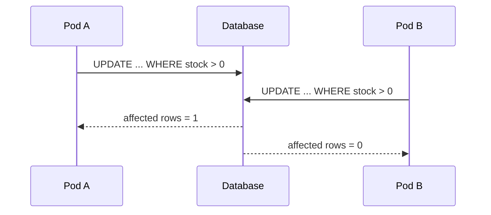
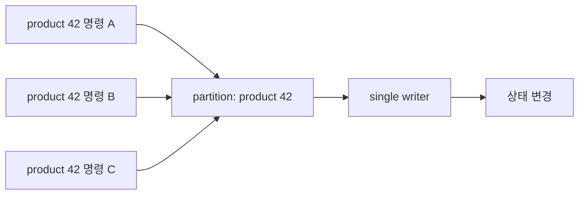

[앞 편](/java-concurrency-primitives)에서는 한 JVM 안에서 `volatile`, `synchronized`, `ReentrantLock`, 세마포어와 CAS가 각각 무엇을 보장하는지 살펴봤다. 이제 애플리케이션 인스턴스를 두 개로 늘려보자.

```text
Pod A ─┐
       ├── product.stock = 1
Pod B ─┘
```

두 Pod가 각자의 `synchronized` 블록에 들어가 재고를 변경한다. Pod A의 monitor와 Pod B의 monitor는 서로 다른 JVM 메모리에 있다. 둘 다 락을 성공적으로 잡고 같은 DB 행을 읽을 수 있다.

```text
Pod A                       Pod B

자신의 lock 획득            자신의 lock 획득
SELECT stock = 1            SELECT stock = 1
UPDATE stock = 0            UPDATE stock = 0
주문 성공                   주문 성공
```

락이 사라진 것이 아니다. **공유 상태와 조정 장치가 서로 다른 경계에 놓인 것**이 문제다. 이 경우 모든 인스턴스가 만나는 DB가 상태 변화의 승자를 결정하기에 가장 가까운 곳이다.

## 먼저 DB가 이미 제공하는 원자성을 사용한다

애플리케이션에서 조회한 뒤 판단하고 저장하는 코드는 경쟁 구간을 길게 만든다.

```java
Product product = repository.findById(id).orElseThrow();

if (product.getStock() <= 0) {
    return false;
}

product.decreaseStock();
return true;
```

재고 하나를 차감하는 규칙은 SQL 한 문장으로 표현할 수 있다.

```sql
UPDATE product
SET stock = stock - 1
WHERE id = :id
  AND stock > 0;
```

결과는 영향받은 행 수로 판단한다.

```text
affected rows = 1 → 조건을 만족해 차감 성공
affected rows = 0 → 재고가 없거나 다른 실행이 먼저 차감
```

Spring Data JPA에서는 영향 행 수를 반환하는 수정 쿼리로 같은 의도를 드러낼 수 있다.

```java
public interface ProductRepository extends JpaRepository<Product, Long> {

    @Modifying(clearAutomatically = true, flushAutomatically = true)
    @Query("""
        update Product p
           set p.stock = p.stock - 1
         where p.id = :id
           and p.stock > 0
        """)
    int decreaseStockIfAvailable(@Param("id") Long id);
}
```

서비스는 같은 트랜잭션 안에서 결과를 비즈니스 의미로 바꾼다.

```java
@Transactional
public boolean purchase(Long productId) {
    return productRepository.decreaseStockIfAvailable(productId) == 1;
}
```

bulk update는 이미 영속성 컨텍스트에 올라온 엔티티의 값을 자동으로 고치지 않는다. 예제의 `clearAutomatically`는 수정 뒤 오래된 엔티티를 계속 읽지 않도록 컨텍스트를 비운다. 같은 트랜잭션에서 그 엔티티의 다른 변경도 관리 중이라면 무작정 비우지 말고 flush와 clear 경계를 명시적으로 설계해야 한다.

PostgreSQL의 기본 `READ COMMITTED`에서 동시에 같은 행을 갱신하려는 두 명령은 필요한 경우 서로를 기다린다. 앞선 트랜잭션이 커밋한 뒤에는 뒤의 `UPDATE`가 최신 행에 대해 `WHERE` 조건을 다시 평가한다. 재고가 이미 0이라면 두 번째 명령은 행을 변경하지 않는다.



이 방식은 `확인 → 변경`을 상태가 있는 곳의 한 원자적 연산으로 압축한다. 단일 행의 단순 상태 전이라면 별도의 분산 락보다 먼저 검토할 만하다.

물론 SQL 한 문장이 모든 비즈니스 작업을 자동으로 원자화하지는 않는다. 주문 생성과 재고 차감이 모두 성공하거나 모두 실패해야 한다면 같은 DB 트랜잭션으로 묶어야 한다. 외부 결제 API까지 포함된다면 DB 트랜잭션만으로 전체 원자성을 만들 수 없으므로 문제의 경계가 다시 넓어진다.

## 제약조건은 마지막 방어선이다

“한 주문에는 결제가 하나만 존재할 수 있다”가 규칙이라면 애플리케이션의 사전 조회만으로 지키지 않는다.

```sql
CREATE UNIQUE INDEX ux_payment_order
ON payment (order_id);
```

두 요청이 동시에 `결제가 아직 없음`을 읽더라도 DB는 둘 중 하나의 INSERT만 받아들인다. `UNIQUE`, `CHECK`, foreign key 같은 제약조건은 잘못된 최종 상태를 저장하지 못하게 하는 강한 방어선이다.

제약조건 위반은 예상 가능한 경쟁 결과일 수 있다. 이를 무조건 서버 오류로 취급하기보다 이미 처리됨, 충돌, 재조회 같은 도메인 결과로 변환해야 한다.

다만 모든 불변조건을 단순한 제약식으로 표현할 수 있는 것은 아니다. 여러 행의 합계나 외부 시스템의 상태가 포함되면 다른 조정 전략이 필요하다.

## 낙관적 락: 충돌이 드물다고 보고 검증한다

낙관적 락은 읽을 때 다른 실행을 막지 않는다. 대신 저장할 때 내가 읽은 이후 상태가 바뀌지 않았는지 확인한다.

```text
id = 42
stock = 10
version = 7
```

갱신 SQL은 개념적으로 다음과 같다.

```sql
UPDATE product
SET stock = :newStock,
    version = version + 1
WHERE id = :id
  AND version = :expectedVersion;
```

```text
affected rows = 1 → 읽은 버전이 아직 유효, 저장 성공
affected rows = 0 → 누군가 먼저 변경, 충돌
```

JPA에서는 엔티티의 version 필드에 `@Version`을 사용해 이 패턴을 적용할 수 있다.

```java
@Entity
class Product {
    @Id
    private Long id;

    private int stock;

    @Version
    private long version;
}
```

장점은 읽는 동안 DB 락을 오래 보유하지 않는다는 것이다. 충돌이 드물고 사용자가 편집한 내용을 잃지 않는 것이 중요할 때 잘 맞는다.

하지만 이름과 달리 “충돌을 해결”해주지는 않는다. **충돌을 발견**해 줄 뿐이다. 실패한 요청을 재시도할지, 사용자에게 알려줄지, 최신 상태와 병합할지는 애플리케이션이 결정해야 한다.

재시도도 무조건 안전하지 않다. 요청 안에 이메일 전송이나 외부 결제처럼 되돌릴 수 없는 효과가 있다면 트랜잭션 재시도로 그 효과가 중복될 수 있다. 재시도 가능한 경계를 분리해야 한다.

재시도하기로 했다면 각 시도는 새 상태를 다시 읽는 **독립된 트랜잭션**이어야 한다. 다음은 `REQUIRES_NEW`로 설정한 `TransactionTemplate`을 사용하는 facade의 모양이다.

```java
public boolean purchaseWithRetry(Long productId) {
    for (int attempt = 1; attempt <= 3; attempt++) {
        try {
            return Boolean.TRUE.equals(transactionTemplate.execute(status -> {
                Product product = productRepository.findById(productId)
                    .orElseThrow();

                if (!product.decreaseStockIfAvailable()) {
                    return false;
                }

                productRepository.flush(); // version 충돌을 이 시도 안에서 확인
                return true;
            }));
        } catch (ObjectOptimisticLockingFailureException conflict) {
            if (attempt == 3) {
                throw conflict;
            }
        }
    }

    throw new IllegalStateException("unreachable");
}
```

무한 재시도하지 않고 횟수와 backoff를 제한해야 한다. 재시도 루프 안에는 DB 상태 변경만 두고, 외부 결제나 메시지 발행처럼 중복되면 안 되는 효과는 별도의 전달 전략으로 분리한다.

## 비관적 락: 먼저 행을 선점하고 작업한다

충돌 가능성이 높고, 읽은 상태를 바탕으로 여러 단계를 수행해야 한다면 행을 먼저 잠그는 방법을 검토한다.

```sql
BEGIN;

SELECT id, stock
FROM product
WHERE id = :id
FOR UPDATE;

-- 조건 판단과 UPDATE

COMMIT;
```

`FOR UPDATE`로 선택된 행은 트랜잭션이 끝날 때까지 충돌하는 다른 갱신과 잠금 요청을 기다리게 한다. 덕분에 읽은 상태를 바탕으로 다음 결정을 내리는 동안 행이 다른 트랜잭션에 의해 바뀌지 않도록 조정할 수 있다.

Spring Data JPA에서는 repository 쿼리에 잠금 모드를 선언하고, 서비스의 트랜잭션이 끝날 때까지 같은 행 락을 유지한다.

```java
public interface ProductRepository extends JpaRepository<Product, Long> {

    @Lock(LockModeType.PESSIMISTIC_WRITE)
    @Query("select p from Product p where p.id = :id")
    Optional<Product> findByIdForUpdate(@Param("id") Long id);
}
```

```java
@Transactional
public boolean purchase(Long productId) {
    Product product = productRepository.findByIdForUpdate(productId)
        .orElseThrow();

    return product.decreaseStockIfAvailable();
}
```

repository 메서드에 `@Lock`만 붙이고 트랜잭션 경계를 잊으면 안 된다. 행 락의 수명은 서비스 메서드의 트랜잭션과 함께 설계해야 한다.

대가는 대기다. 임계영역이 길면 처리량이 낮아지고 타임아웃 가능성이 커진다. 여러 행을 서로 다른 순서로 잠그면 데드락이 생길 수 있다.

```text
Transaction A: product 1 잠금 → product 2 대기
Transaction B: product 2 잠금 → product 1 대기
```

잠금 대상이 여러 개라면 모든 코드 경로에서 같은 순서로 획득하는 규칙이 필요하다. 무엇보다 행 락을 잡은 채 느린 외부 API를 호출하지 않는 편이 좋다. 네트워크 지연만큼 DB의 경쟁 구간이 늘어나기 때문이다.

## 셋 중 무엇을 선택할까

조건부 UPDATE, 낙관적 락, 비관적 락은 우열 관계가 아니다.

| 상황 | 먼저 검토할 방법 | 이유 |
| --- | --- | --- |
| 단일 행의 단순 차감·상태 전이 | 조건부 UPDATE | 짧은 원자 연산으로 의도를 직접 표현 |
| 충돌이 드물고 읽은 버전을 검증해야 함 | 낙관적 락 | 읽는 동안 잠금을 오래 보유하지 않음 |
| 충돌이 잦고 읽은 상태로 여러 DB 작업 수행 | 비관적 락 | 작업 전에 경쟁자를 기다리게 함 |
| 절대로 저장되면 안 되는 중복·범위 | DB constraint | 모든 애플리케이션 경로에 적용되는 방어선 |
| 복잡한 여러 행 불변조건 | 높은 격리 수준 또는 명시적 조정 | 직렬화 실패와 재시도까지 설계 필요 |

격리 수준을 올리는 것도 선택지다. 하지만 `SERIALIZABLE`이라는 이름만 믿고 애플리케이션이 아무것도 하지 않아도 되는 것은 아니다. DB는 직렬화할 수 없는 실행을 중단시킬 수 있고, 애플리케이션은 그 실패를 안전하게 재시도해야 한다. 사용하는 DB의 정확한 격리 계약과 이상 현상을 확인해야 한다.

핵심은 “락을 써야 하나?”가 아니라 다음 두 질문이다.

```text
상태가 실제로 저장되는 곳에서
불변조건을 직접 표현할 수 있는가?

경쟁에서 진 실행을
기다리게 할 것인가, 실패시킬 것인가, 재시도할 것인가?
```

## DB를 쓰는 것도 이미 분산 동시성 제어다

여러 Pod가 하나의 DB를 조정자로 사용한다면 시스템은 이미 프로세스 경계를 넘었다. 해결책이 DB 안에 있다는 이유로 분산 환경의 해결책이 아닌 것이 아니다.

```text
여러 애플리케이션 인스턴스
        ↓
DB의 원자적 명령·행 락·제약조건
        ↓
하나의 승자와 허용된 최종 상태
```

공유 상태의 source of truth가 DB이고 보호할 규칙도 DB 트랜잭션 안에서 표현할 수 있다면, DB는 가장 자연스러운 조정 지점이다. Redis를 추가해 분산 락을 만들면 조정 시스템과 실제 상태 저장소가 둘로 나뉜다. 새로운 장애 모드와 일관성 질문이 생긴다.

따라서 “서버가 여러 대니까 분산 락”은 너무 빠른 결론이다.

## 분산 락은 만료되는 소유권이다

DB 트랜잭션으로 감싸기 어려운 긴 작업이나 DB 밖의 공유 자원을 조정해야 할 때 Redis 같은 외부 시스템의 락을 검토할 수 있다. 단일 Redis 인스턴스를 이용한 기본 모양은 다음과 같다.

```text
SET lock:product:42 <random-token> NX PX 30000
```

- `NX`: 키가 없을 때만 획득한다.
- `PX`: 락에 유효 시간을 둔다.
- random token: 락을 획득한 시도를 식별한다.

해제할 때는 단순히 `DEL`하지 않는다. 작업이 오래 걸려 내 락이 만료된 뒤 다른 실행이 새 락을 획득했을 수 있기 때문이다. 값이 내가 가진 token과 같을 때만 삭제해야 한다.

```lua
if redis.call("get", KEYS[1]) == ARGV[1] then
    return redis.call("del", KEYS[1])
end
return 0
```

그런데 token 비교만으로 모든 문제가 끝나지 않는다.

```text
1. A가 30초 lease 획득
2. A 프로세스가 긴 GC pause 또는 네트워크 정지를 겪음
3. lease 만료
4. B가 새 lease 획득 후 상태 변경
5. A가 다시 깨어나 늦은 변경을 전송
```

A는 자신이 여전히 유효한 소유자라고 착각할 수 있다. 실제 자원을 쓰는 쪽이 증가하는 **fencing token**을 확인하고 오래된 소유자의 명령을 거절하게 만드는 이유다.

분산 락을 사용할 때는 최소한 다음을 결정해야 한다.

- 락 획득과 해제의 정확한 원자성
- 소유자 token 검증
- lease 시간과 연장 정책
- 프로세스 정지와 네트워크 단절 시 동작
- 락 서비스 장애 시 fail-open 또는 fail-closed
- 오래된 소유자의 쓰기를 막을 fencing 전략
- 획득 실패 시 대기, 재시도, 즉시 실패 중 무엇을 할지

이 질문에 답하지 않은 `SET NX` 한 줄은 완성된 분산 락 설계가 아니다.

## 경쟁을 막는 대신 없앨 수도 있다

같은 상품의 명령을 같은 큐 파티션으로 보내 한 consumer가 순서대로 처리하도록 만들 수 있다.



이 구조는 매 요청이 같은 상태를 직접 선점하게 하지 않고 상태 변경의 소유자를 한곳으로 모은다. 자원 키별 순서가 중요하고 비동기 처리를 받아들일 수 있을 때 강력하다.

대신 큐도 새로운 계약을 요구한다.

- 파티션 키가 정말 같은 불변조건의 경계와 일치하는가
- consumer 재시작 뒤 메시지가 다시 처리되어도 안전한가
- 처리 실패와 poison message를 어떻게 다루는가
- backlog가 늘어날 때 사용자에게 무엇을 보여주는가
- 순서가 필요한 범위와 처리량을 어떻게 균형 잡는가

락을 큐로 바꿨다고 실패가 사라지는 것이 아니라 **경쟁을 직렬화하고 실패를 명시적인 메시지 처리 문제로 옮긴 것**이다.

## 멱등성은 다음 글의 문제다

여기까지 다룬 것은 서로 다른 작업 A와 B가 겹칠 때 불변조건을 지키는 방법이다. 같은 논리적 작업 A가 응답 유실 때문에 다시 전달되는 **멱등성**은 다른 축이다. 실무에서는 둘이 함께 나타나지만 같은 문제는 아니다. 멱등성 키의 생성 주체, 작업 동일성, 저장 상태와 실패 구간은 별도 글에서 다룬다.

## 결국 선택 기준은 상태의 경계다

세 편을 관통한 문제는 바뀌지 않았다.

```text
한 JVM의 필드
→ synchronized, Lock, CAS

여러 트랜잭션이 공유하는 DB 상태
→ constraint, 조건부 UPDATE, 낙관적·비관적 락

여러 프로세스와 시스템이 공유하는 논리적 상태
→ DB 조정, lease 기반 분산 락, fencing, queue, single writer
```

기술을 고르는 순서는 바깥에서 안쪽이 아니라 안쪽에서 바깥쪽이어야 한다.

1. 지켜야 할 불변조건을 문장으로 쓴다.
2. 그 불변조건을 이루는 논리적 상태의 경계를 찾는다.
3. 서로 충돌하는 상태 전이를 찾는다.
4. 상태가 있는 가장 가까운 계층에서 원자적으로 표현할 방법을 찾는다.
5. 그 계층으로 해결할 수 없을 때만 더 넓은 조정 장치를 추가한다.
6. 대기, 실패, 재시도, 장애 시의 의미까지 계약으로 만든다.

동시성 문제의 본질은 락이 아니다. **독립적으로 진행되는 실행들의 상대적 순서를 통제할 수 없는데 시스템의 올바름이 그 순서에 의존하는 것**이다. 좋은 해결책은 모든 것을 잠그는 코드가 아니라, 그 불확실한 순서 속에서도 허용된 상태만 남도록 경계를 설계한 코드다.

## 더 읽어보기

- [PostgreSQL: Transaction Isolation](https://www.postgresql.org/docs/current/transaction-iso.html)
- [PostgreSQL: Explicit Locking](https://www.postgresql.org/docs/current/explicit-locking.html)
- [Redis: Distributed Locks](https://redis.io/docs/latest/develop/clients/patterns/distributed-locks/)
- [Redis: SET command](https://redis.io/docs/latest/commands/set/)
