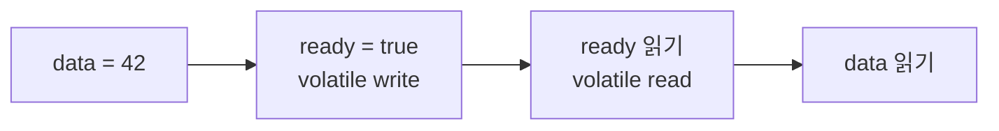

[앞 편](/concurrency-essence)에서는 동시성 문제를 공유 상태, 통제할 수 없는 인터리빙, 그리고 불변조건의 문제로 정의했다. 이제 그 상태가 한 JVM의 메모리에 있다고 해보자.

```java
class Inventory {
    private int stock = 1;

    boolean purchase() {
        if (stock <= 0) {
            return false;
        }
        stock--;
        return true;
    }
}
```

두 스레드가 같은 `Inventory` 인스턴스의 `purchase()`를 호출하면 둘 다 성공할 수 있다. 해결책을 찾다 보면 `volatile`, `synchronized`, `AtomicInteger`, `ReentrantLock`, 세마포어가 한꺼번에 등장한다. 이름을 외우기 전에 JVM 안에서 무엇이 보장되지 않았는지 세 갈래로 나누는 편이 낫다.

## 원자성, 가시성, 순서성

### 원자성: 중간에 끼어들 수 있는가

`stock--`는 읽기, 계산, 쓰기의 조합이다. 두 실행이 같은 값을 읽은 뒤 각각 결과를 저장할 수 있다.

```text
Thread A: read 1 ───────────── write 0
Thread B:       read 1 ───────────── write 0
```

우리가 원하는 것은 `재고가 남았는지 확인하고 하나 차감한다`는 상태 전이 전체가 다른 실행과 분리되는 것이다.

### 가시성: 변경한 값이 다른 스레드에 보이는가

한 스레드가 필드를 변경했다고 해서 동기화되지 않은 다른 스레드가 그 값을 원하는 시점에 관찰한다고 보장할 수는 없다.

```java
boolean running = true;

// Thread A
while (running) {
    doWork();
}

// Thread B
running = false;
```

`running`에 적절한 동기화가 없다면 A가 B의 변경을 관찰한다는 Java Memory Model의 보장이 없다. 실제 하드웨어 캐시만의 문제가 아니다. 컴파일러와 런타임이 동기화 없는 프로그램에 허용받은 최적화까지 포함한 언어 수준의 계약 문제다.

### 순서성: 다른 스레드도 그 선후관계를 신뢰할 수 있는가

```java
int data = 0;
boolean ready = false;

// Thread A
data = 42;
ready = true;

// Thread B
if (ready) {
    System.out.println(data);
}
```

코드에는 `data`를 쓴 뒤 `ready`를 쓰도록 적혀 있다. 그러나 동기화가 없다면 B가 `ready == true`를 관찰했을 때 `data == 42`까지 관찰한다는 스레드 간 순서 보장이 없다.

이 세 문제는 서로 얽히지만 같은 것은 아니다.

```text
Atomicity  → 상태 전이가 쪼개지는가
Visibility → 변경 결과가 전달되는가
Ordering   → 선후관계를 다른 실행도 신뢰할 수 있는가
```

## happens-before는 스레드 사이의 전달 계약이다

Java Memory Model은 한 동작의 결과가 다른 동작에 보이도록 보장되는 순서 관계를 **happens-before**로 정의한다. 실제 시계로 몇 나노초 먼저 실행됐다는 뜻이 아니다. 앞선 쓰기의 효과를 뒤의 읽기가 관찰할 수 있게 하는 언어의 보장이다.

대표적인 규칙은 다음과 같다.

```text
같은 스레드의 앞선 동작
    happens-before
같은 스레드의 뒤 동작

volatile write
    happens-before
그 값을 관찰하는 이후 volatile read

monitor unlock
    happens-before
같은 monitor의 이후 lock

Thread.start() 이전 동작
    happens-before
시작된 스레드의 동작

스레드의 모든 동작
    happens-before
그 스레드에 대한 join() 반환 이후 동작
```

happens-before는 전이적이다. 이 성질 때문에 동기화 지점 앞에서 준비한 데이터가 반대편 동기화 지점 뒤로 안전하게 전달된다.

## `volatile`: 상태를 전달하지만 복합 연산을 묶지는 않는다

앞선 `ready`에 `volatile`을 붙여보자.

```java
int data = 0;
volatile boolean ready = false;

// Thread A
data = 42;
ready = true;

// Thread B
if (ready) {
    System.out.println(data);
}
```

관계는 다음처럼 연결된다.



B가 `ready == true`를 관찰했다면 그보다 앞서 쓰인 `data = 42`도 볼 수 있도록 보장된다. 그래서 `volatile`은 단순한 “최신 값 옵션”보다 **상태 공개와 순서 관계를 만드는 장치**로 이해하는 편이 정확하다.

그렇다고 아래 코드가 안전해지는 것은 아니다.

```java
private volatile int stock = 1;

boolean purchase() {
    if (stock <= 0) {
        return false;
    }
    stock--;
    return true;
}
```

각 읽기와 쓰기의 가시성은 얻었지만 `확인 → 차감` 전체를 하나로 묶지 않았다. 두 스레드가 여전히 1을 읽을 수 있다. `volatile`은 복합 연산에 상호 배제를 제공하지 않는다.

`volatile`이 잘 맞는 곳은 독립된 상태 플래그, 한 스레드가 쓰고 여러 스레드가 읽는 설정 참조, 이미 만들어진 객체를 안전하게 공개하는 지점처럼 **한 번의 읽기와 쓰기로 의미가 완성되는 상태**다.

## `synchronized`: 상호 배제와 메모리 동기화를 함께 제공한다

재고 변경 전체를 같은 monitor로 보호하면 한 번에 한 스레드만 들어갈 수 있다.

```java
class Inventory {
    private int stock = 1;

    synchronized boolean purchase() {
        if (stock <= 0) {
            return false;
        }
        stock--;
        return true;
    }
}
```

여기서 `synchronized`는 두 가지 역할을 한다.

1. **상호 배제**: 같은 monitor를 획득해야 하는 임계영역에는 한 스레드만 진입한다.
2. **메모리 동기화**: monitor 해제 이전의 쓰기는 같은 monitor를 이후 획득한 스레드에 전달된다.

두 번째 역할 때문에 `synchronized`를 단순히 “동시에 한 명만 들어오게 하는 문법”으로만 설명하면 부족하다.

중요한 조건은 **같은 monitor**를 사용해야 한다는 점이다.

```java
synchronized (lockA) {
    stock--;
}

synchronized (lockB) {
    return stock;
}
```

서로 다른 객체에 잠그면 기대한 상호 배제와 happens-before 관계가 생기지 않는다. 보호 대상과 락의 대응 관계가 코드 전체에서 일관돼야 한다.

## `ReentrantLock`: 더 새로운 `synchronized`가 아니다

`ReentrantLock`은 `synchronized`와 같은 기본적인 재진입 상호 배제 의미를 제공하면서 명시적인 제어 기능을 더한다.

```java
class Inventory {
    private final ReentrantLock lock = new ReentrantLock();
    private int stock = 1;

    boolean purchase() {
        lock.lock();
        try {
            if (stock <= 0) {
                return false;
            }
            stock--;
            return true;
        } finally {
            lock.unlock();
        }
    }
}
```

명시적인 락은 반드시 `finally`에서 해제해야 한다. 예외나 조기 반환으로 unlock을 건너뛰면 이후 실행이 영원히 기다릴 수 있다.

`ReentrantLock`이 필요한 대표적인 이유는 다음과 같다.

- `tryLock()`으로 기다리지 않고 획득을 시도해야 한다.
- 락을 기다리는 동안 인터럽트에 반응해야 한다.
- 여러 `Condition` 대기 집합이 필요하다.
- 획득과 해제가 하나의 블록 구조를 벗어나야 한다.
- 공정성 정책을 명시적으로 검토해야 한다.

공정 락은 오래 기다린 스레드에 유리한 정책을 제공하지만 일반적으로 처리량 비용이 생길 수 있다. “공정한 락이 더 안전하다”가 아니라 기아 방지 요구와 성능 특성을 함께 보고 선택해야 한다.

단순한 임계영역이라면 `synchronized`가 짧고 해제 실수도 없다. `ReentrantLock`은 대체 세대가 아니라 **추가 제어가 실제로 필요한 상황을 위한 다른 인터페이스**다.

## 세마포어: 상태의 소유권보다 통행량을 제한한다

세마포어는 일정 개수의 permit을 관리한다.

```java
class PartnerClient {
    private final Semaphore permits = new Semaphore(20);

    Response call(Request request) throws InterruptedException {
        permits.acquire();
        try {
            return invokePartner(request);
        } finally {
            permits.release();
        }
    }
}
```

이 코드는 외부 API를 동시에 호출하는 작업을 최대 20개로 제한한다. DB 커넥션, 제한된 장치, 무거운 작업 슬롯처럼 **동시에 사용할 수 있는 용량**을 표현할 때 잘 맞는다.

permit이 1개인 binary semaphore는 상호 배제처럼 사용할 수 있지만 일반적인 lock과 소유권 모델이 같지는 않다. 세마포어의 permit에는 특정 스레드 소유권이 연결되지 않는다. 따라서 “공유 상태를 보호한다”는 의도가 중심이라면 lock이 더 명확하고, “N개까지 허용한다”가 중심이라면 semaphore가 더 자연스럽다.

세마포어도 `release()` 누락, 무제한 대기, 너무 큰 permit 수 같은 운영 문제를 만들 수 있다. 통행량을 제한했다고 그 내부의 복합 상태 전이가 자동으로 안전해지는 것도 아니다.

## `AtomicInteger`와 CAS: 예상한 상태일 때만 바꾼다

단일 숫자의 원자적 변경은 `AtomicInteger`로 표현할 수 있다.

```java
AtomicInteger stock = new AtomicInteger(1);

boolean purchase() {
    while (true) {
        int current = stock.get();
        if (current <= 0) {
            return false;
        }
        if (stock.compareAndSet(current, current - 1)) {
            return true;
        }
    }
}
```

CAS(compare-and-set)는 현재 값이 내가 앞서 읽은 값과 같을 때만 새 값을 기록한다.

```text
현재 값 == 예상 값
→ 변경 성공

현재 값 != 예상 값
→ 다른 실행이 먼저 변경함, 실패 후 다시 판단
```

대기 중인 스레드를 락 큐에 세우지 않고 경쟁을 해결할 수 있지만 공짜는 아니다. 충돌이 심하면 반복 실패로 CPU를 쓰고, 여러 필드에 걸친 불변조건을 하나의 CAS로 표현하기 어렵다. 원자 클래스를 여러 개 사용한다고 그 조합까지 원자적이 되는 것도 아니다.

재고 차감 뒤 주문 목록도 함께 변경해야 한다면 `stock` 하나의 CAS 성공만으로 전체 작업이 완성되지 않는다. 논리적 상태의 경계를 다시 확인해야 한다.

## 도구를 고르기 전에 공유를 줄일 수 있는지 본다

가장 관리하기 쉬운 동시성 상태는 공유되지 않는 상태다.

- 변경할 수 없는 객체를 사용한다.
- 상태를 한 스레드 안에 가둔다.
- 작업별 지역 변수를 사용한다.
- `ConcurrentHashMap.compute`처럼 의도에 맞는 고수준 원자 연산을 사용한다.
- 메시지나 큐를 통해 상태 소유자 한 곳에 변경을 전달한다.

락을 정교하게 만드는 것보다 공유 가변 상태의 범위를 줄이는 설계가 더 강한 경우가 많다.

## 무엇을 선택할까

| 상황 | 먼저 검토할 도구 | 주의할 점 |
| --- | --- | --- |
| 상태 플래그와 안전한 공개 | `volatile` | 복합 read-modify-write는 보호하지 않음 |
| 짧고 단순한 임계영역 | `synchronized` | 같은 monitor와 올바른 보호 범위 필요 |
| 시간 제한·인터럽트·여러 조건 | `ReentrantLock` | 반드시 `finally`에서 해제 |
| 동시에 N개까지만 허용 | `Semaphore` | 공유 상태의 원자성을 대신하지 않음 |
| 단일 값의 조건부 변경 | Atomic 클래스와 CAS | 충돌 시 반복 비용, 복합 불변조건 |
| 이미 제공되는 고수준 동작 | concurrent collection | 여러 메서드의 조합은 별도 검토 |

그리고 이 도구들은 전부 **한 JVM 안에서 같은 동기화 객체를 공유한다는 전제** 위에 있다.

애플리케이션 인스턴스가 두 개가 되면 각 JVM에는 서로 다른 `lock`이 생긴다. Pod A가 자신의 monitor를 잡아도 Pod B는 알지 못한다. 그러나 둘은 DB의 같은 재고 행을 변경할 수 있다. 공유 상태의 경계가 프로세스 밖으로 넓어지는 순간, 문제의 본질은 같지만 조정 수단은 달라진다.

다음 편에서는 DB의 조건부 UPDATE, 낙관적 락과 비관적 락을 비교한 뒤, 분산 락과 큐가 필요한 경계까지 나아간다.

## 더 읽어보기

- [Java Language Specification: Happens-before Order](https://docs.oracle.com/javase/specs/jls/se21/html/jls-17.html#jls-17.4.5)
- [Java API: ReentrantLock](https://docs.oracle.com/en/java/javase/21/docs/api/java.base/java/util/concurrent/locks/ReentrantLock.html)
- [Java API: Semaphore](https://docs.oracle.com/en/java/javase/21/docs/api/java.base/java/util/concurrent/Semaphore.html)
- [Java API: AtomicInteger](https://docs.oracle.com/en/java/javase/21/docs/api/java.base/java/util/concurrent/atomic/AtomicInteger.html)
