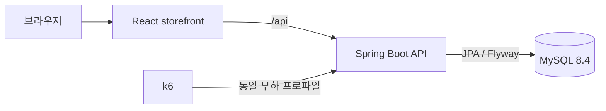

# Baseline Architecture

## 목표와 비목표

`main`은 실험 결과를 비교할 수 있는 작고 올바른 커머스 기준선입니다. 상품 목록을 읽고, 장바구니에서 주문을 만들고, 하나의 MySQL 트랜잭션 안에서 재고를 차감합니다.

Redis, Kafka, 대기열, 분산 락은 기준선에 미리 넣지 않습니다. 각 기술이 만든 차이를 관찰할 수 있도록 해당 `lab/*` 브랜치가 소유합니다.

## 실행 구성



프론트엔드 컨테이너의 Nginx가 `/api` 요청을 백엔드로 전달합니다. 로컬 Vite 개발 서버도 같은 경로를 `localhost:8080`으로 프록시하므로 브라우저 코드의 API 계약은 환경마다 달라지지 않습니다.

## 프론트엔드 소유권

작은 단일 화면 애플리케이션이므로 상품 탐색과 장바구니 흐름은 가장 좁은 storefront 기능 경계가 소유합니다.

```text
route/app entry
  ↓
storefront feature (화면, 상태, API 경계, 도메인 타입)
  ↓
shared composites / product-neutral UI / lib
```

- API URL, 요청 생성, envelope 해석, transport 오류는 feature의 data 경계에 둡니다.
- 장바구니는 한 화면에만 필요하므로 로컬 feature 상태가 소유합니다.
- 범용 UI는 상품, 가격, 주문 API 타입을 import하지 않습니다.
- loading, empty, error, disabled, success 상태에서도 행과 컨트롤 크기를 안정적으로 유지합니다.

## 백엔드 소유권

```text
api/       HTTP 계약, 검증, request→command/query, result→response
domain/    엔티티 행동, use-case facade, collaborator, repository port
infra/     Spring Data JPA, MySQL repository 구현, 기술 설정
support/   공통 응답, 오류, 관측성
```

허용 방향은 `api → domain`, `infra → domain`, `api/domain/infra → support`입니다. Controller는 facade만 호출하며 Spring Data, EntityManager, infra 구현을 알지 못합니다. Domain repository는 Spring Data 인터페이스를 상속하지 않습니다.

## Query: 상품 조회

1. ProductController가 HTTP 입력을 Query 또는 facade 인자로 변환합니다.
2. ProductService의 read-only 트랜잭션이 ProductReader를 호출합니다.
3. ProductReader가 domain repository port를 통해 상품을 읽습니다.
4. API response mapper가 트랜잭션 밖 lazy load 없이 응답 DTO를 만듭니다.

연관관계가 없는 상품 목록의 예상 read query는 1회입니다. 페이지나 연관 데이터가 추가되면 lab에서 명시적인 projection 또는 split query를 선택합니다.

## Command: 주문 생성

1. OrderRequest가 JSON 형태 검증과 Command 변환을 소유합니다.
2. OrderService가 주문 use case의 유일한 트랜잭션 owner입니다.
3. ProductReader가 주문 대상 상품을 한 번에 읽고 잠금 정책을 적용합니다.
4. ProductEntity가 자신의 재고를 예약하며 부족 여부를 판단합니다.
5. OrderEntity가 최대 주문 라인 수와 금액 불변식을 지킵니다.
6. OrderSaver가 새 aggregate를 저장하고 트랜잭션 안에서 Result를 완성합니다.

이미 관리 중인 ProductEntity는 dirty checking으로 반영하며 불필요한 save를 호출하지 않습니다. Order의 line collection은 최대 20개로 제한된 bounded aggregate이므로 parent-side collection을 허용합니다. 모든 to-one 연관은 명시적으로 lazy입니다.

## 오류와 API 계약

성공과 실패는 하나의 envelope를 사용합니다.

```json
{"data": {"example": true}, "error": null}
```

```json
{"data": null, "error": {"code": "OUT_OF_STOCK", "message": "재고가 부족합니다."}}
```

HTTP shape 검증은 API 경계에, 재고와 주문 제한 같은 정책은 상태를 소유한 domain entity에 둡니다. 전역 오류 타입이 HTTP status와 공개 메시지를 결정합니다.

## 공통 측정 규약

모든 lab은 같은 seed, 요청 payload, warm-up, 부하 단계, CPU/메모리 한도를 재사용합니다. 최소 공통 지표는 요청 수, 처리량, p50/p95/p99, 오류율입니다. 각 lab은 DB query 수, cache origin load, Kafka lag, 대기열 활성 인원처럼 메커니즘을 직접 설명하는 지표를 추가해야 합니다.

관측 결과는 인과를 자동으로 증명하지 않습니다. 한 번에 하나의 독립 변수를 바꾸고, 최소 두 번 이상 반복하며, 원시 결과와 환경 정보를 함께 보존합니다.
